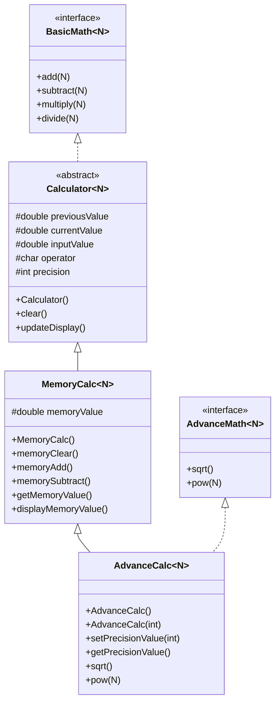

# Calculator App - Java OOP Project

## Overview
This is a comprehensive Java-based calculator application developed as part of the Java OOP Section 5 course. The project demonstrates core Object-Oriented Programming principles including inheritance, polymorphism, abstract classes, interfaces, and generics.

The application is structured into multiple layers:
1.  **BasicMath**: An interface defining basic arithmetic operations.
2.  **Calculator**: An abstract base class that implements `BasicMath` and provides core display and clear logic.
3.  **MemoryCalc**: Extends `Calculator` to include memory storage features (M+, M-, MC, MR).
4.  **AdvanceMath**: An interface defining advanced operations like square root and power.
5.  **AdvanceCalc**: The final implementation that combines memory features with advanced math and configurable display precision.

## Features
- **Generic Support**: Handles any numeric type that extends `Number` (Integer, Double, etc.).
- **Arithmetic Operations**: Addition, Subtraction, Multiplication, Division (with divide-by-zero protection).
- **Memory Management**: Add to memory, subtract from memory, clear memory, and recall memory values.
- **Advanced Math**: Square root and Power functions.
- **Dynamic Precision**: Configure output display from 0 to 10 decimal places.
- **Formatted Ledger Display**: Prints operations in a professional, aligned ledger format.

## Class Diagram (UML)

## Concepts Used
- **Inheritance**: Classes build on top of each other (AdvanceCalc extends MemoryCalc extends Calculator).
- **Interfaces**: Defining contracts for arithmetic and advanced operations.
- **Abstract Classes**: Providing a common base with partial implementation.
- **Generics**: Using `<N extends Number>` to allow flexibility in input types.
- **Polymorphism**: Overriding `updateDisplay` to handle specific formatting needs.
- **Encapsulation**: Protecting internal state with `protected` fields and providing controlled access via methods.

## Screenshots
### Basic Operations

### Advanced Operations & Precision

## Authors
- **Sanyam Sood** - [GitHub Profile](https://github.com/Starksood)

## Repository
[https://github.com/Starksood/CalculatorApp](https://github.com/Starksood/CalculatorApp)
