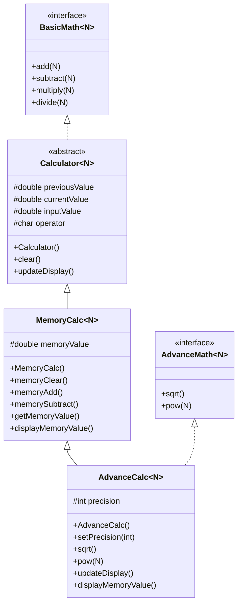

# Calculator App - Java OOP Project

## Overview
This is a comprehensive Java-based calculator application developed as part of the Java OOP Section 5 course. The project demonstrates core Object-Oriented Programming principles including inheritance, polymorphism, abstract classes, interfaces, and generics.

The application is structured into multiple layers:
1.  **BasicMath**: An interface defining basic arithmetic operations.
2.  **Calculator**: An abstract base class that implements `BasicMath` and provides core display and clear logic.
3.  **MemoryCalc**: Extends `Calculator` to include memory storage features (M+, M-, MC, MR).
4.  **AdvanceMath**: An interface defining advanced operations like square root and power.
5.  **AdvanceCalc**: The final implementation that combines memory features with advanced math and configurable display precision.

## Features
- **Generic Support**: Handles any numeric type that extends `Number` (Integer, Double, etc.).
- **Arithmetic Operations**: Addition, Subtraction, Multiplication, Division (with divide-by-zero protection).
- **Memory Management**: Add to memory, subtract from memory, clear memory, and recall memory values.
- **Advanced Math**: Square root and Power functions.
- **Dynamic Precision**: Configure output display from 0 to 10 decimal places.
- **Formatted Ledger Display**: Prints operations in a professional, aligned ledger format with thousand separators.

## Project Structure
```
CalculatorApp/
├── src/
│   ├── BasicMath.java          # Interface for basic arithmetic operations
│   ├── AdvanceMath.java         # Interface for advanced math operations
│   ├── Calculator.java          # Abstract base class with core functionality
│   ├── MemoryCalc.java          # Adds memory storage capabilities
│   ├── AdvanceCalc.java         # Full-featured calculator implementation
│   └── TestBench.java           # Test driver demonstrating all features
├── out/                         # Compiled class files
├── README.md                    # This file
└── CalculatorApp.iml            # IntelliJ IDEA module file
```

## Class Diagram (UML)


## Getting Started

### Prerequisites
- Java Development Kit (JDK) 8 or higher
- A Java IDE (IntelliJ IDEA, Eclipse, VS Code) or command-line tools

### Installation

1. **Clone the repository**
   ```bash
   git clone https://github.com/Starksood/CalculatorApp.git
   cd CalculatorApp
   ```

2. **Compile the project**
   ```bash
   javac -d out src/*.java
   ```

3. **Run the test bench**
   ```bash
   java -cp out TestBench
   ```

### Using an IDE

1. Open the project folder in your IDE
2. Ensure the JDK is configured
3. Run `TestBench.java` as the main class

## Usage Examples

### Basic Arithmetic
```java
AdvanceCalc calc = new AdvanceCalc();
calc.add(10.5);        // Adds 10.5 to current value
calc.subtract(3.2);    // Subtracts 3.2
calc.multiply(2);      // Multiplies by 2
calc.divide(4);        // Divides by 4
```

### Memory Operations
```java
calc.memoryAdd();           // Adds current value to memory
calc.memorySubtract();      // Subtracts current value from memory
double mem = calc.getMemoryValue();  // Retrieves memory value
calc.memoryClear();         // Clears memory to zero
```

### Advanced Math
```java
calc.pow(2);           // Squares the current value
calc.sqrt();           // Takes square root of current value
```

### Precision Control
```java
calc.setPrecision(4);  // Sets display to 4 decimal places
calc.setPrecision(2);  // Sets display to 2 decimal places
```

## Testing

### Running the Test Suite

The `TestBench.java` class provides a comprehensive test of all calculator features. It performs the following sequence:

1. **Initialization**: Creates an `AdvanceCalc` instance (displays "Calculator On")
2. **Addition**: Adds 10.22 to the current value (0)
3. **Subtraction**: Subtracts 5 from the result
4. **Memory Add**: Stores current value in memory
5. **Multiplication**: Multiplies current value by 3
6. **Memory Subtract**: Subtracts current value from memory
7. **Division**: Divides current value by 4
8. **Precision Change**: Sets precision to 4 decimal places
9. **Power**: Raises current value to the power of 2
10. **Square Root**: Takes square root of current value
11. **Memory Recall**: Adds the stored memory value
12. **Memory Clear**: Clears the memory
13. **Calculator Clear**: Resets the calculator

### Expected Output

When you run `TestBench`, you should see formatted output similar to:

```
Calculator On
Calculator Precision is 4 decimal places.

        0.0000
+      10.2200
=============
       10.2200

        10.2200
-       5.0000
=============
        5.2200

Memory Add              5.2200

         5.2200
*        3.0000
=============
        15.6600

Memory Subtract        -10.4400

        15.6600
/        4.0000
=============
         3.9150

Calculator Precision is 4 decimal places.

         3.9150
^        2.0000
=============
        15.3272

√       15.3272
=============
         3.9150

Using memory value
         3.9150
+      -10.4400
=============
        -6.5250

Memory Clear             0.0000

Calculator Cleared
```

### Manual Testing

You can create your own test cases by modifying `TestBench.java` or creating a new test class:

```java
public class CustomTest {
    public static void main(String[] args) {
        AdvanceCalc calc = new AdvanceCalc();
        
        // Test case 1: Basic arithmetic
        calc.add(100);
        calc.divide(4);
        calc.multiply(3);
        
        // Test case 2: Memory operations
        calc.memoryAdd();
        calc.clear();
        calc.add(calc.getMemoryValue());
        
        // Test case 3: Advanced operations
        calc.setPrecision(6);
        calc.pow(3);
        calc.sqrt();
        
        calc.clear();
    }
}
```

### Testing Edge Cases

Consider testing these scenarios:
- **Division by zero**: The calculator handles this gracefully
- **Negative numbers**: All operations support negative values
- **Large numbers**: Test with values exceeding typical ranges
- **Precision limits**: Test with precision values 0-10
- **Memory overflow**: Test with very large memory values

## OOP Concepts Demonstrated

### 1. Inheritance
Classes build on top of each other in a hierarchical structure:
- `AdvanceCalc` extends `MemoryCalc`
- `MemoryCalc` extends `Calculator`
- Each subclass adds new functionality while inheriting parent capabilities

### 2. Interfaces
Two interfaces define contracts for calculator operations:
- `BasicMath<N>`: Defines add, subtract, multiply, divide
- `AdvanceMath<N>`: Defines sqrt, pow

### 3. Abstract Classes
`Calculator` is abstract, providing:
- Common implementation for basic operations
- Protected fields accessible to subclasses
- Abstract behavior that subclasses can override

### 4. Generics
Using `<N extends Number>` allows:
- Type-safe operations with any numeric type
- Flexibility to use Integer, Double, Float, etc.
- Compile-time type checking

### 5. Polymorphism
Method overriding demonstrates polymorphism:
- `updateDisplay()` is overridden in `AdvanceCalc` for custom precision
- `displayMemoryValue()` is overridden to use configurable precision

### 6. Encapsulation
Protected fields and public methods:
- Internal state (`currentValue`, `memoryValue`) is protected
- Controlled access through public methods
- Data integrity maintained through validation (e.g., precision range)

## API Documentation

Full JavaDoc documentation is available in the source code. To generate HTML documentation:

```bash
javadoc -d docs -sourcepath src -subpackages .
```

Then open `docs/index.html` in your browser.

## Known Limitations

- Division by zero returns `Infinity` (Java's default behavior)
- Generic type `N` is converted to `double` internally, which may lose precision for very large integers
- No GUI interface (console-based only)
- No persistent storage of calculations

## Future Enhancements

- [ ] Add trigonometric functions (sin, cos, tan)
- [ ] Implement logarithmic operations
- [ ] Add calculation history
- [ ] Create a graphical user interface (GUI)
- [ ] Support for complex numbers
- [ ] Unit testing with JUnit
- [ ] Persistent memory storage

## Contributing

Contributions are welcome! Please follow these steps:

1. Fork the repository
2. Create a feature branch (`git checkout -b feature/AmazingFeature`)
3. Commit your changes (`git commit -m 'Add some AmazingFeature'`)
4. Push to the branch (`git push origin feature/AmazingFeature`)
5. Open a Pull Request

## License

This project is created for educational purposes as part of a Java OOP course.

## Authors

- **Sanyam Sood** - [GitHub Profile](https://github.com/Starksood)

## Acknowledgments

- Java OOP Section 5 Course
- Object-Oriented Programming principles and best practices
- Java documentation and community resources

## Repository

[https://github.com/Starksood/CalculatorApp](https://github.com/Starksood/CalculatorApp)

---

**Last Updated**: May 2026
